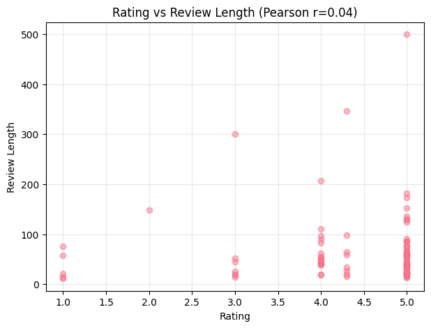
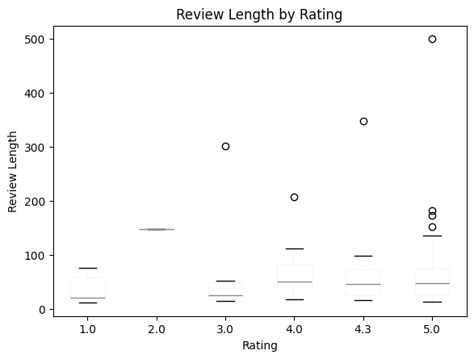
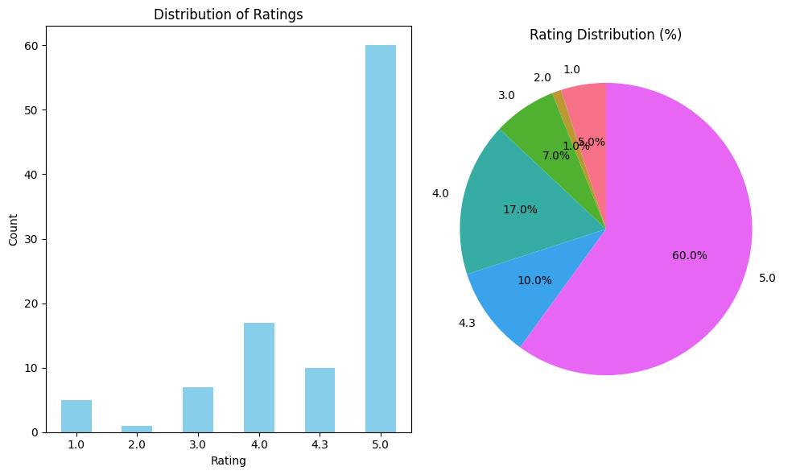
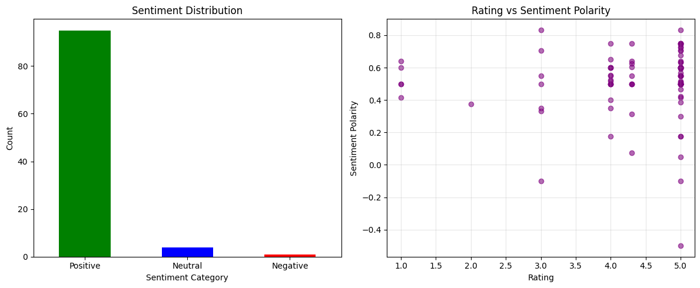
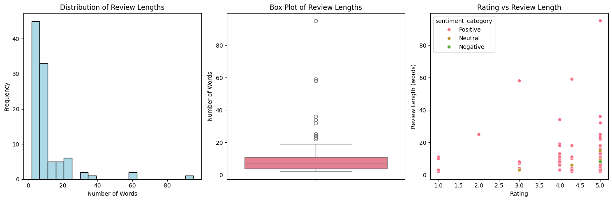
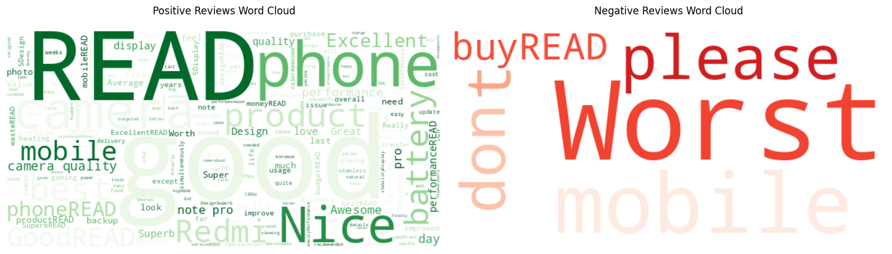
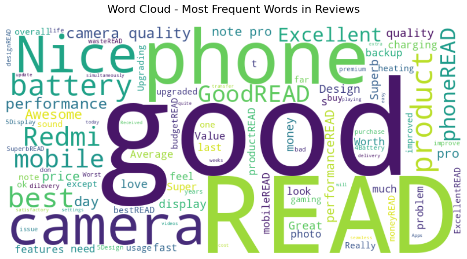
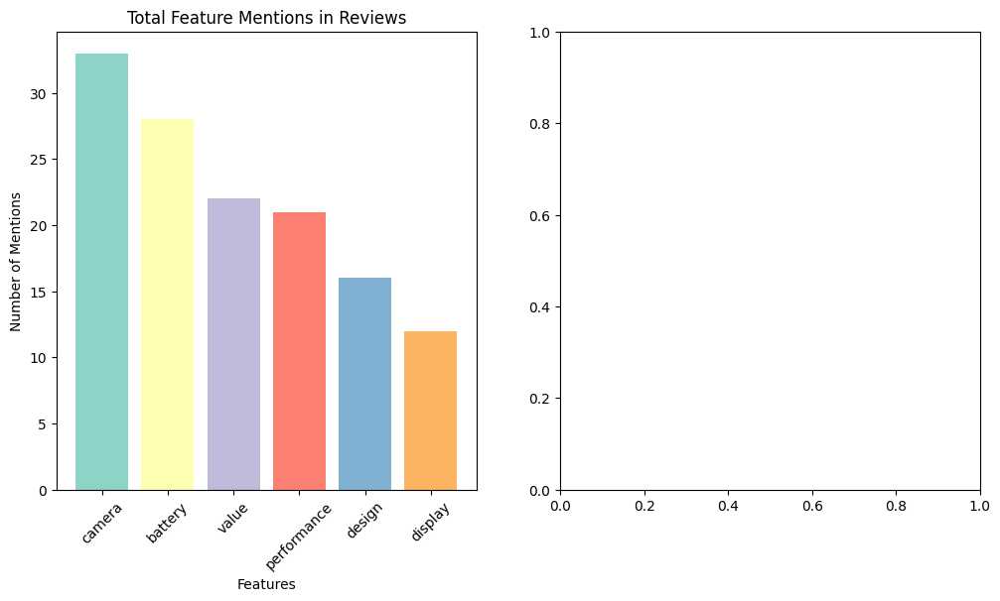
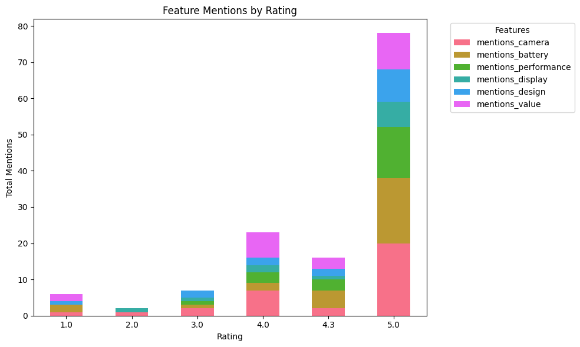
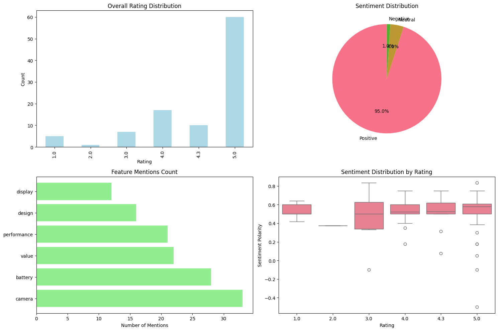

# 📱 Redmi Note 14 Pro – Customer Review Analysis Using Classical NLP

This project focuses on building a complete NLP pipeline to analyze customer reviews of the **Redmi Note 14 Pro** smartphone.  
The dataset consists of 100+ real customer reviews scraped from Flipkart.

---

# ✅ Project Structure

```
├── data/
│   └── redmi_note14_reviews.csv
├── images/
│   ├── image1.png
│   ├── image2.png
│   ├── image3.png
│   ├── image4.png
│   ├── image5.png
│   ├── image6.png
│   ├── image7.png
│   ├── image8.png
│   ├── image9.png
│   └── image10.png
├── notebooks/
│   └── NLP_Analysis_RedmiNote14Pro.ipynb
└── README.md
```

---

# ✅ Visual Outputs

Below are the visual results generated during the NLP analysis.

### **Figure 1**


### **Figure 2**


### **Figure 3**


### **Figure 4**


### **Figure 5**


### **Figure 6**


### **Figure 7**


### **Figure 8**


### **Figure 9**


### **Figure 10**


---

# ✅ Overview & Pipeline

The NLP pipeline includes:
- Data scraping
- Cleaning & preprocessing
- Sentiment analysis
- Word frequency analysis
- Feature extraction
- Statistical testing
- Visualization
- Business insights

---

# ✅ Results Summary

- **Total Reviews:** 100  
- **Average Rating:** 4.39/5  
- **Positive Sentiment:** 95  
- **Neutral:** 4  
- **Negative:** 1  

### Most Discussed Features:
- Camera – 33 mentions  
- Battery – 28 mentions  
- Value – 22 mentions  

---

# ✅ Business Insights

- Strong customer satisfaction overall  
- Camera & battery are major strengths  
- Minimal negative feedback  
- Recommend improving visibility of positive reviews  
- Monitor minor issues reported by few users  

---

# ✅ Author

**Om Shrigiriwar**  
PCCoE – CSE (AI & ML), Batch 2027
